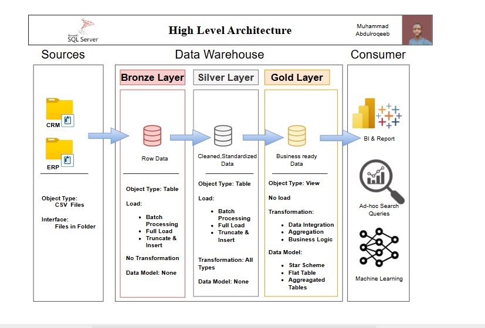

# Data Warehouse and Analytics Project
Welcome to the Data Warehouse and Analytics Project repository! 
This project showcases my approach to building a data warehouse and performing analytics, from data integration to generating meaningful insights. It serves as a portfolio project to demonstrate what I’ve learned and apply key concepts in data engineering and analytics.

## 🏗️ Data Architecture
The architecture of this project follows the **Medallion Architecture** pattern with **Bronze**, **Silver**, and **Gold** layers:



1. **Bronze Layer**  
   Stores **raw data** as ingested from source systems. For this project, data is sourced from **CSV files** and ingested into a **SQL Server database**.

2. **Silver Layer**  
   Performs **data cleansing, standardization, and normalization**, ensuring high-quality data for analytical use.

3. **Gold Layer**  
   Contains **business-ready data**, modeled into a **star schema** optimized for reporting and advanced analytics.

## 📖 Project Overview

This project includes:

- **Data Architecture**: Designing a modern data warehouse using the Medallion pattern.
- **ETL Pipelines**: Extracting, transforming, and loading data from raw files to structured tables.
- **Data Modeling**: Building fact and dimension tables for analytical queries.
- **Analytics & Reporting**: Writing SQL queries for key business insights.

## 🛠️ Tools Used

- **SQL Server Management Studio (SSMS)**: For database management and running T-SQL queries.
- **Draw.io**: For designing data architecture diagrams and star schema models.
- **Notion**: For project planning, documentation, and task tracking.

## 🚀 Project Requirements

### **Data Engineering – Building the Data Warehouse**
**Goal:**  
Create a modern data warehouse using **SQL Server** to centralize sales data, providing a foundation for analytical reporting and data-driven decision-making.

**Key Specifications:**  
- **Data Sources:** Load data from two primary systems (ERP and CRM) provided as **CSV files**.  
- **Data Quality:** Perform data cleaning and resolve inconsistencies to ensure accuracy and reliability.  
- **Integration:** Merge data from both sources into a unified, analytics-friendly data model.  
- **Scope:** Work with the most recent dataset only; historical data storage is outside the scope.  
- **Documentation:** Deliver clear and structured documentation for the data model to assist both technical teams and business users.  

---

### **Data Analysis – Business Intelligence & Reporting**
**Goal:**  
Design **SQL-based analytics** to generate actionable insights into:  
- **Customer Behavior**  
- **Product Performance**  
- **Sales Trends**  

These insights aim to provide stakeholders with essential business metrics to drive informed and strategic decisions.  

## 📂 Repository Structure
```
data-warehouse-project/
│
├── datasets/                           # Raw datasets used for the project (ERP and CRM data)
│
├── docs/                               # Project documentation and architecture details
│
├── scripts/                            # SQL scripts for ETL and transformations
│   ├── bronze/                         # Scripts for extracting and loading raw data
│   ├── silver/                         # Scripts for cleaning and transforming data
│   ├── gold/                           # Scripts for creating analytical models
│
├── tests/                              # Test scripts and quality files
│
├── README.md                           # Project overview and instructions
└── LICENSE                             # License information for the repository

---
